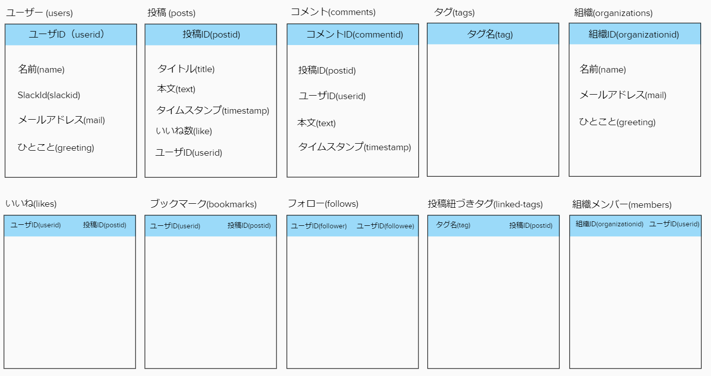
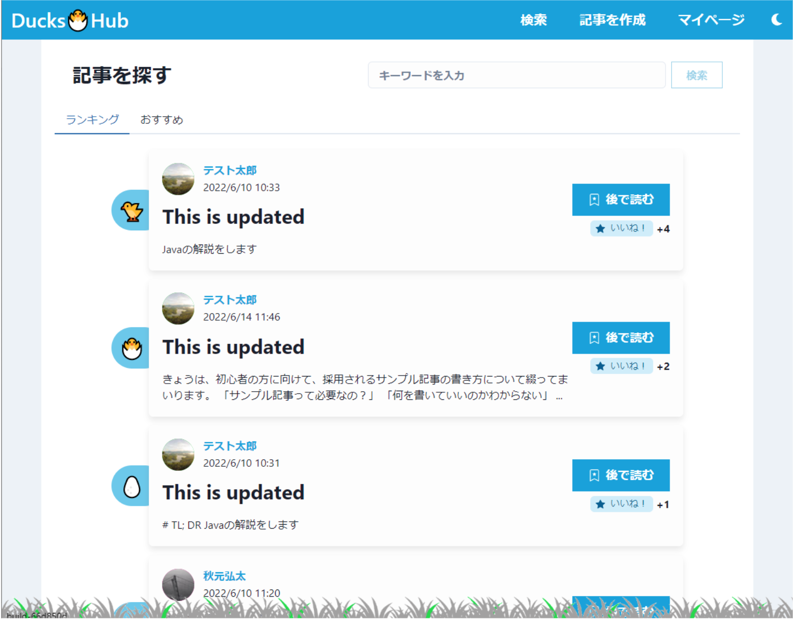
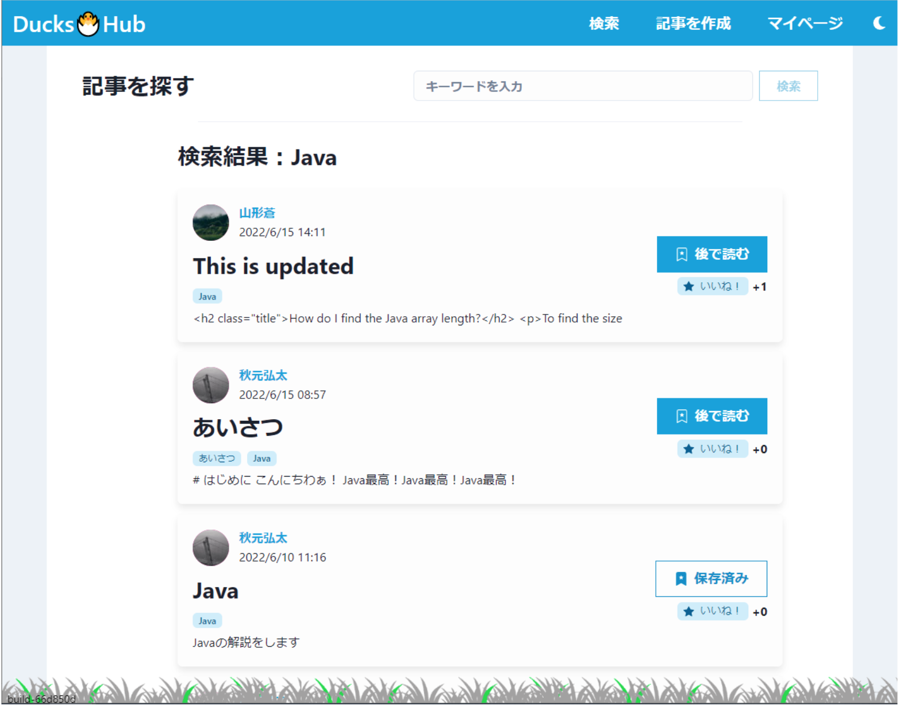
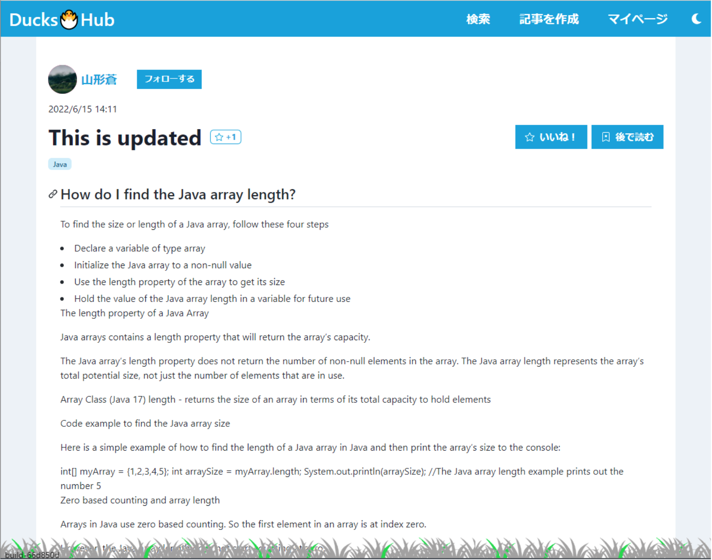
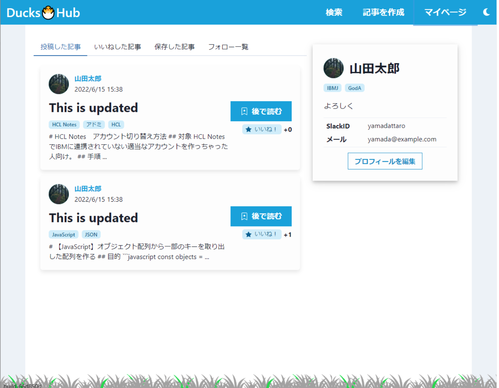
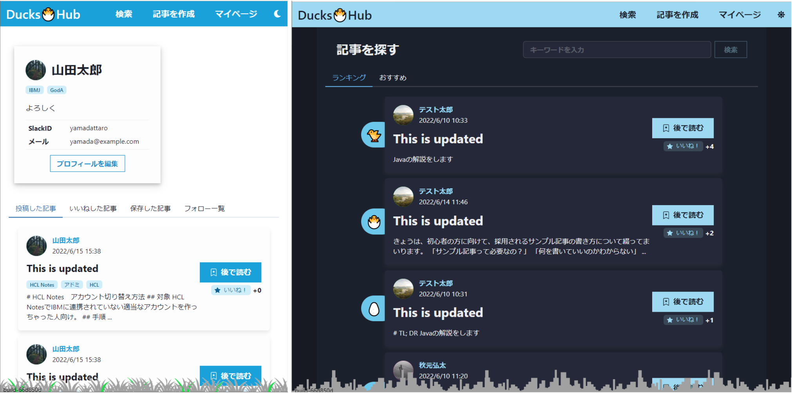
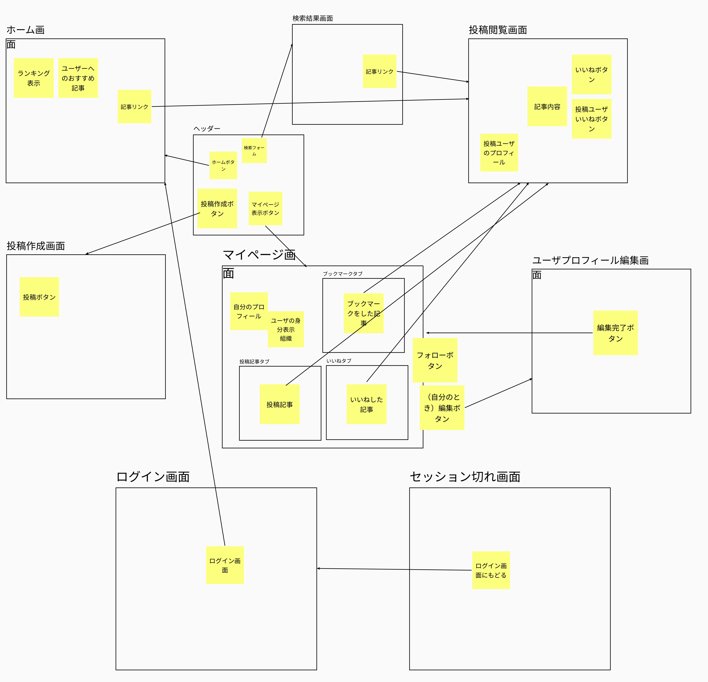

Technology used: Node.js, Express, MongoDB, TypeScript, React.

<h1 align="center"> Ducks🐣Hub </h1>

## English

This is a knowledge sharing platform application created by David Choulex, Kouta Akimoto and 2 others.

### Features

**1. Article**

- Create an article with markdown.
- Post article.
- Search article.
- Show recommended article.
- Show article detail.
- Show popular article based on number of likes.
- Show posted article.
- Show liked article.

**2. Comment**

- Comment an article.
- Show article's commments.

**3. Follow**

- Follow an user.
- Show followers.

**4. Like**

- Like an article.
- Show article's number of likes.

**5. Tag**

- Create tag to article.
- Create organization tags.

**6. Bookmark**

- Bookmark an article.
- Show bookmarked article on user's profile page.

**7. Account**

- Login
- Users are created based on IBM internal account.
- Show my profile information.

**8. Organizations**

- Show organizations.
- Delete organizations.

**9. Others**

- Responsive design.
- Dark mode.
- Pagination.

### Entity

### User Interfaces

1. Home Page - Ranking tab and Recommendation tab
   

2. Search Page
   

3. Article Detail Page - Like and Bookmark
   

4. My Profile Page - Posted article tab, Liked article tab, Bookmark tab, Follow tab
   

5. Other Features - Responsive design and dark mode
   

## 日本語

フロントエンド：React + TypeScript による静的ウェブサイト

- [React](https://reactjs.org/)
  - JavaScript をメインでフロントエンド UI を作成するフレームワーク
  - イベントによる DOM 変更等を`State`と呼ばれる機構で記述可能
  - html への記述が最小限（head のみ）で済み、ロジックとビジュアルを同時に定義できる
- [TypeScript](https://www.typescriptlang.org/)
  - プログラミング言語
  - JavaScript に強い静的型付けを導入
    - 強力な構文チェック
    - モダンな追加言語機能（interface 等）の追加
  - JS に随時変換
    - ライブラリなど多くの資産を共有可能
    - JS が動くすべての環境で利用可能

## 主な使用ライブラリ

- [`react-router-dom`](https://reactrouter.com/)
  - React 環境で URL によるルーティングを提供
  - React ではふつう１ページ毎しか作成できないが、これを使うことで疑似的に複数ページの Web サイトを１つのプロジェクトで表示できるようになる
- [`chakra-ui`](https://chakra-ui.com/)
  - React 環境における Bootstrap のような、総合的なスタイル済みコンポーネントライブラリ
  - カラーテーマやダークモード対応、レスポンシブ対応などが高速に可能
- [`react-md-editor`](https://uiwjs.github.io/react-md-editor/)
  - React で Markdown エディタおよびレンダラーコンポーネントを提供
  - Markdown 文法に沿ったテキストを value として渡すことで高速にレンダリングが実行

他詳しくは [`./frontend/package.json`](./frontend/package.json) を参照

## 画面遷移図

## 操作方法 - フロントエンド

（プロジェクトルートに移動後）

1. 初回 Clone 時：`npm install`
   - 必要な npm パッケージをインストール
2. 実装時：`npm start`
   - dev 環境でサーバが起動
   - オートリロードが自動有効
3. ビルド時：`npm run build`
   - `/build` に成果物が作成

## 現在の仕様

- ユーザ登録機能の実装なし -> w3 連携を想定
  - DB に定義されたユーザを用いて開発
