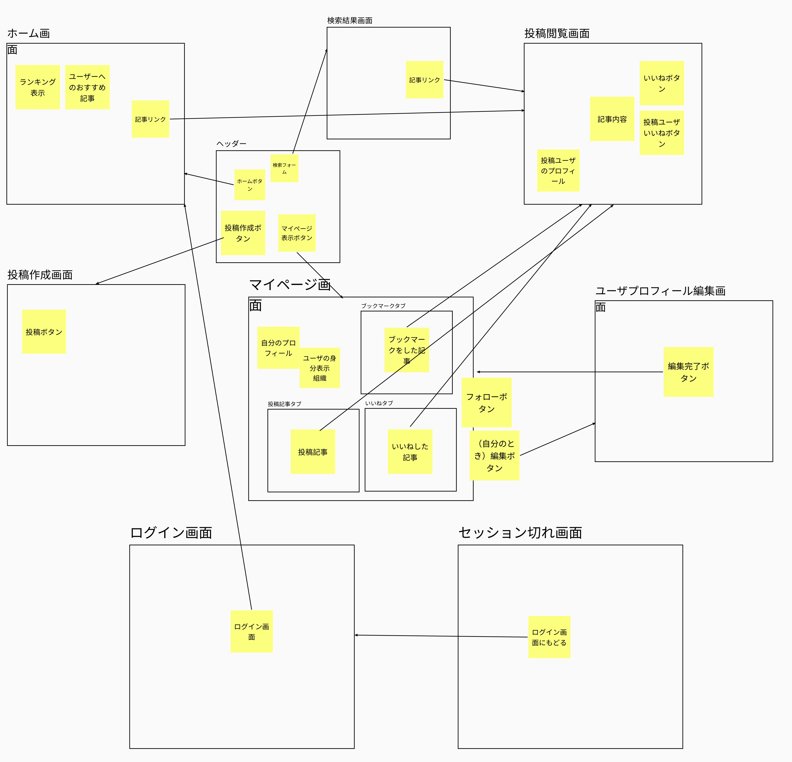

# Docks🐣Hub

フロントエンド：React + TypeScript による静的ウェブサイト

- [React](https://reactjs.org/)
  - JavaScript をメインでフロントエンド UI を作成するフレームワーク
  - イベントによる DOM 変更等を`State`と呼ばれる機構で記述可能
  - html への記述が最小限（head のみ）で済み、ロジックとビジュアルを同時に定義できる
- [TypeScript](https://www.typescriptlang.org/)
  - プログラミング言語
  - JavaScript に強い静的型付けを導入
    - 強力な構文チェック
    - モダンな追加言語機能（interface 等）の追加
  - JS に随時変換
    - ライブラリなど多くの資産を共有可能
    - JS が動くすべての環境で利用可能

## 主な使用ライブラリ

- [`react-router-dom`](https://reactrouter.com/)
  - React 環境で URL によるルーティングを提供
  - React ではふつう１ページ毎しか作成できないが、これを使うことで疑似的に複数ページの Web サイトを１つのプロジェクトで表示できるようになる
- [`chakra-ui`](https://chakra-ui.com/)
  - React 環境における Bootstrap のような、総合的なスタイル済みコンポーネントライブラリ
  - カラーテーマやダークモード対応、レスポンシブ対応などが高速に可能
- [`react-md-editor`](https://uiwjs.github.io/react-md-editor/)
  - React で Markdown エディタおよびレンダラーコンポーネントを提供
  - Markdown 文法に沿ったテキストを value として渡すことで高速にレンダリングが実行

他詳しくは [`./frontend/package.json`](./frontend/package.json) を参照

## 画面遷移図

## 操作方法

（プロジェクトルートに移動後）

1. 初回 Clone 時：`npm install`
   - 必要な npm パッケージをインストール
2. 実装時：`npm start`
   - dev 環境でサーバが起動
   - オートリロードが自動有効
3. ビルド時：`npm run build`
   - `/build` に成果物が作成

## 現在の仕様

- ユーザ登録機能の実装なし -> w3 連携を想定
  - DB に定義されたユーザを用いて開発
